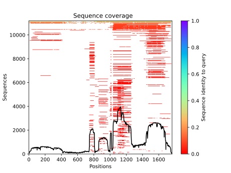
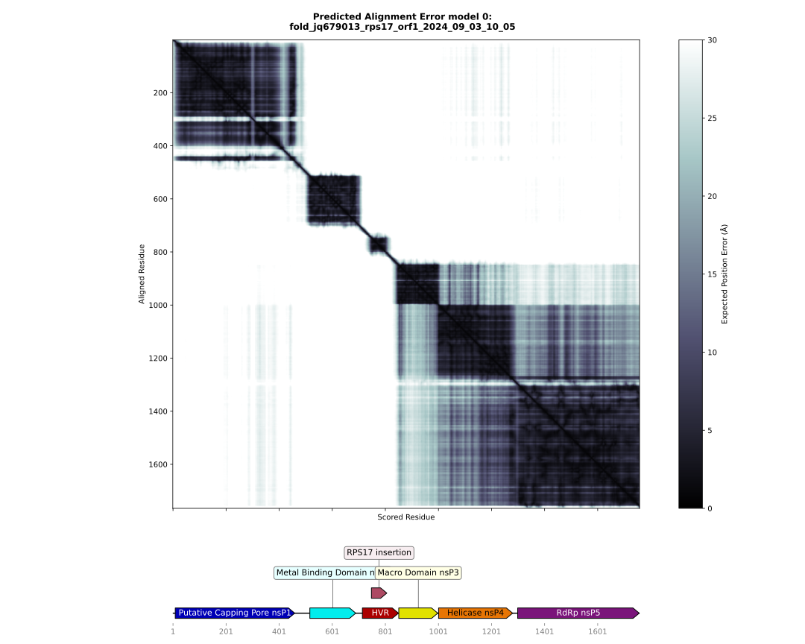

# Alphafold Metrics Visualisation

This tool is used to visualize as plot the Alphafold metrics as:
- the Multiple Sequence Alignment (MSA) with coverage (with Alphafold2 outputs only).
- the predicted Local Difference Distances Test (pLDDT) scores for each model.
- the Predicted Alignment Error (PAE) if the Alphafold run contains these data.

The code is mostly inspired by the work of [Jasper Zuallaert](https://github.com/jasperzuallaert/VIBFold/blob/main/visualize_alphafold_results.py).

## Conda environment

A [conda](https://docs.conda.io/projects/conda/en/latest/index.html) YAML environment file is provided: 
`conda_env/alphafold_metrics_visualisation_env.yml`. The file contains all the dependencies to run the script.
The conda environment is created using the command:
```shell script
# create the environment
conda conda_env create -f conda_env/alphafold_metrics_visualisation_env.yml

# activate the environment
conda activate alphafold_metrics_visualisation
```

## Usage

The help can be displayed:
```shell
conda activate alphafold_metrics_visualisation

# for the general help
./alphafold_metrics_visualisation.py --help

# for the Alphafold2 metrics visualisation help
./alphafold_metrics_visualisation.py alphafold2 --help

# for the Alphafold3 metrics visualisation help
./alphafold_metrics_visualisation.py alphafold3 --help

conda deactivate
```

A CSV domain file can be provided to map these domains on the Predicted Alignment Error (PAE) heatmap,
the CSV file must have this shape:

|domain                    |start|end |color  |
|--------------------------|-----|----|-------|
|Putative Capping Pore nsP1|9    |459 |#0000b6|
|Metal Binding Domain nsP2 |516  |689 |#02eded|
|HVR                       |714  |850 |#ab0000|
|RPS17 insertion           |748  |806 |#ad4a63|
|Macro Domain nsP3         |851  |998 |#e1e100|
|Helicase nsP4             |1001 |1280|#e77504|
|RdRp nsP5                 |1299 |1757|#7a147a|


Example of usage with alphafold3 outputs:
```shell
conda activate alphafold_metrics_visualisation

./alphafold_metrics_visualisation.py alphafold3 --out <RESULTS_DIRECTORY> --domains <CSV_DOMAINS_FILE> \
<ALPHAFOLD3_MODELING_OUTPUT_DIRECTORY>

conda deactivate
```


## Outputs

### MSA with coverage plot

For **Alphafold2 only**, the Multiple Sequence Alignment (MSA) plot.


This heatmap representation of the MSA indicates all sequences mapped to the input sequences. The color scale indicates 
the identity score, and sequences are ordered from top (the largest identity) to bottom (the lowest identity). White 
regions are not covered, which occurs with subsequence entries in the database. The black line qualifies the relative 
coverage of the sequence with respect to the total number of aligned sequences.

### pLDDT scores plot

The predicted Local Difference Distances Test (pLDDT) score for all the models.


The models are classified by `ranking score` value for Alphafold3 and `pLDDT score` value for Alphafold2.

This plot displays the predicted LDDT per residue position. Here is what the AlphaFold developers report about this 
metric:

> - Regions with pLDDT > 90 are expected to be modeled to high accuracy. These should be suitable for any application 
> that benefits from high accuracy (e.g. characterizing binding sites).
> - Regions with pLDDT between 70 and 90 are expected to be modeled well (a generally good backbone prediction).
> - Regions with pLDDT between 50 and 70 are low confidence and should be treated with caution.
> - The 3D coordinates of regions with pLDDT < 50 often have a ribbon-like appearance and should not be interpreted. 
> We show in our paper that pLDDT < 50 is a reasonably strong predictor of disorder, i.e., it suggests such a region is 
> either unstructured in physiological conditions or only structured as part of a complex.
> - Structured domains with many inter-residue contacts are likely to be more reliable than extended linkers or 
> isolated long helices.
> - Unphysical bond lengths and clashes do not usually appear in confident regions. Any part of a structure with 
> several of these should be disregarded (from [https://alphafold.ebi.ac.uk/faq](https://alphafold.ebi.ac.uk/faq)).

### PAE plot

For each model, if the data are available, a Predicted Alignment Error (PAE) plot.
And if the different domains' positions of the protein are known, the map of these domains.


The PAE plot identifies, in a pairwise fashion, the absolute error (Ångströms) of relative position between residues. 
In the color scale of the plot, black corresponds to 0 Å, whereas larger errors are colored in white.
Along the diagonal of the heat map, most elements are expected to be close to 0 Å. Well-defined blocks represent a 
domain of high confidence. A very good model would display a complete dark heat map.

In the example above, we see that this is not the case because this example is a poly-protein with multiple domains, as 
you can see on the map under the heatmap. 

