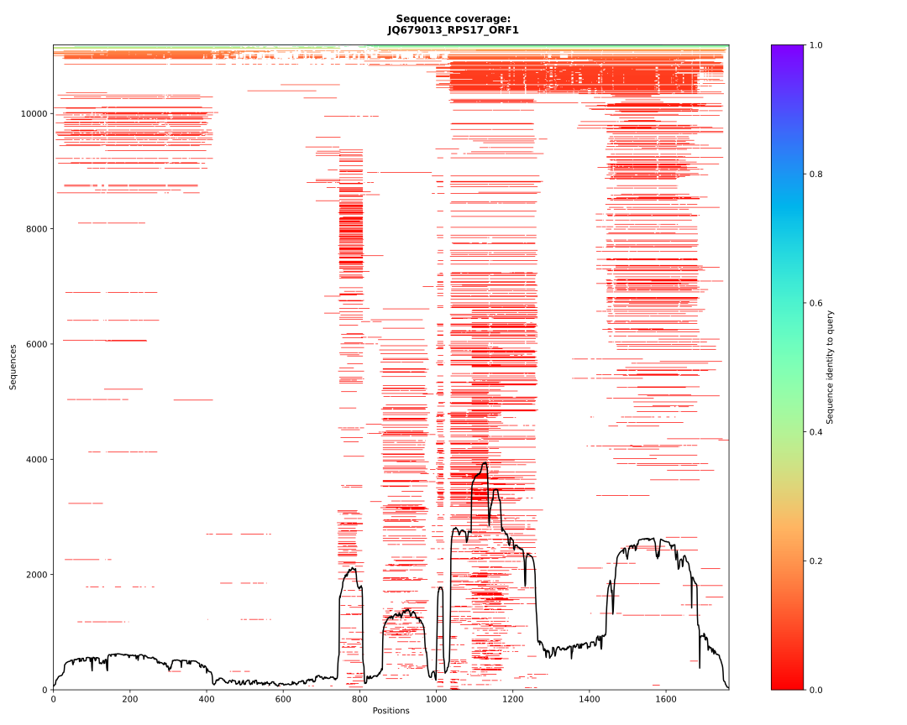
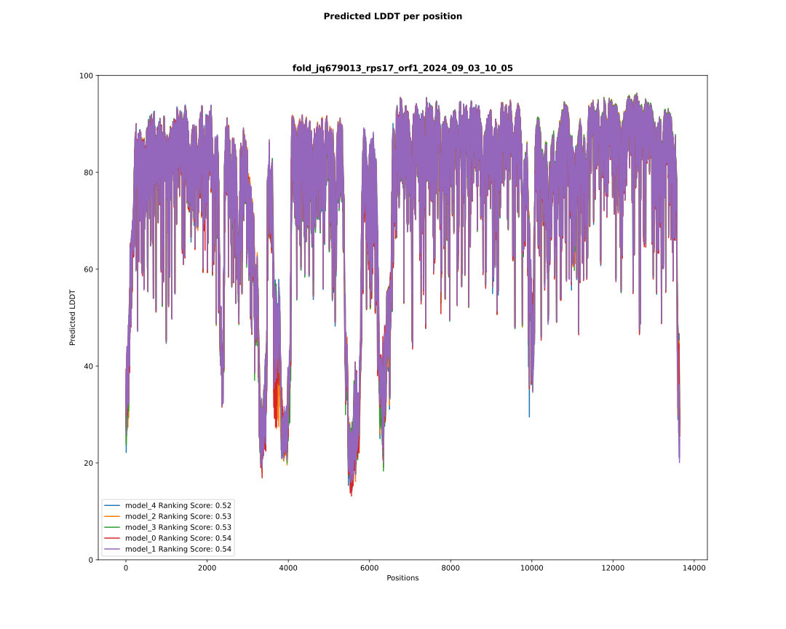

# Alphafold Metrics Visualisation

This tool is used to visualize as plot the Alphafold metrics as:
- the Multiple Sequence Alignment (MSA) with coverage.
- the predicted Local Difference Distances Test (pLDDT) scores for each model.
- the Predicted Alignment Error (PAE) if the Alphafold run contains those data.

The code is mostly inspired by the work of [Jasper Zuallaert](https://github.com/jasperzuallaert/VIBFold/blob/main/visualize_alphafold_results.py).

## Conda environment

A [conda](https://docs.conda.io/projects/conda/en/latest/index.html) YAML environment file is provided: 
`conda_env/alphafold_metrics_visualisation_env.yml`. The file contains all the dependencies to run the script.
The conda environment is created using the command:
```shell script
# create the environment
conda conda_env create -f conda_env/alphafold_metrics_visualisation_env.yml

# activate the environment
conda activate alphafold_metrics_visualisation
```

## Usage

Example of usage:
```shell
conda activate alphafold_metrics_visualisation

./alphafold_metrics_visualisation.py --out results <PATH_ALPHAFOLD_OUTPUT_DIRECTORY>

conda deactivate
```

## Outputs

### MSA with coverage plot



### Models' pLDDT scores plot



### PAE plot